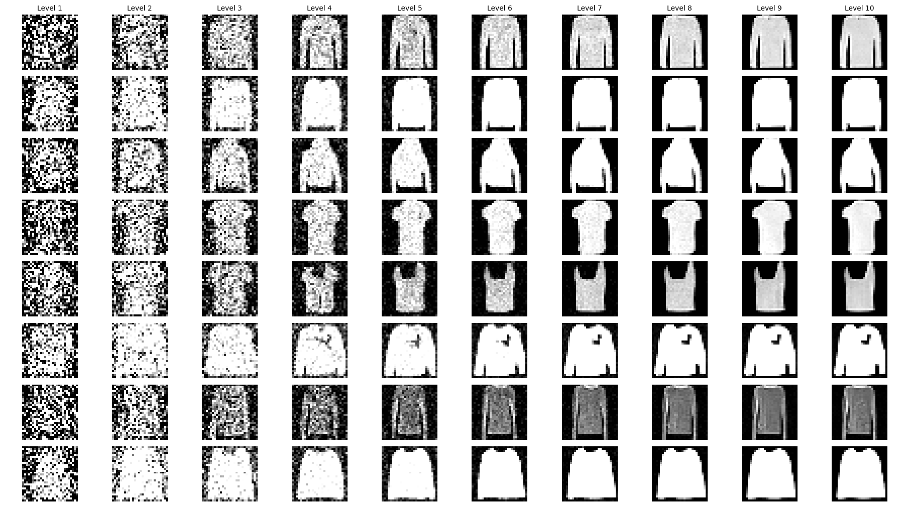
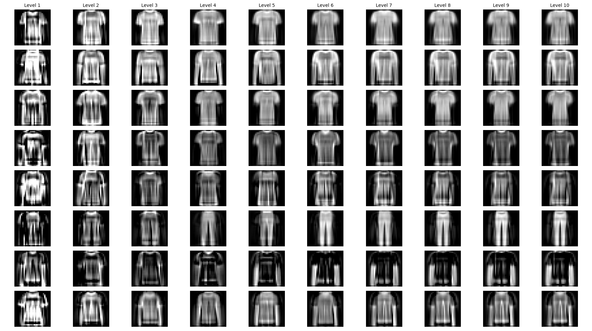

# Score based generative modeling

## Dependency installation
You can either create a new conda environment using the provided environment.yml file, or install the required packages in an existing environment.

```bash
conda env create -f environment.yml -n gda
```

```bash
pip install -r requirements.txt
```

## Training
```bash 
python training_code.py \
  --total-steps 10000 \
  --batch-size 64 \
  --allowed-classes 0 1 2 \
  --L 10 \
  --sigma-1 1.0 \
  --sigma-L 0.01 \
  --lr 0.001 \
  --ngf 64 \
  --save-prefix MYMODEL
  ```

You can pass the following arguments to allow training in the latent space of PCA:
- `--PCA-components`: Number of PCA components to use.
- `--PCA-model-save-path`: Path to save the trained PCA model.

## Sampling

### From data space
```bash 
python sampling.py \
    --batch-size 8 \
    --model-path author_code/mnist/SAVED_MODEL_5.pt \
    --show
```

### From latent space
```bash
python sampling_pca.py \
    --batch-size 8 \
    --model-path PCA/SAVED_MODEL_5_fmnist.pt \
    --pca-path author_code/PCA/PCA_64_012.joblib \
    --show
```

In both sampling methods, you can also save the generated samples using the `--out` argument which requires a path to save the samples.

## Example generated samples

**Raw data generation**


**PCA latent space generation**
